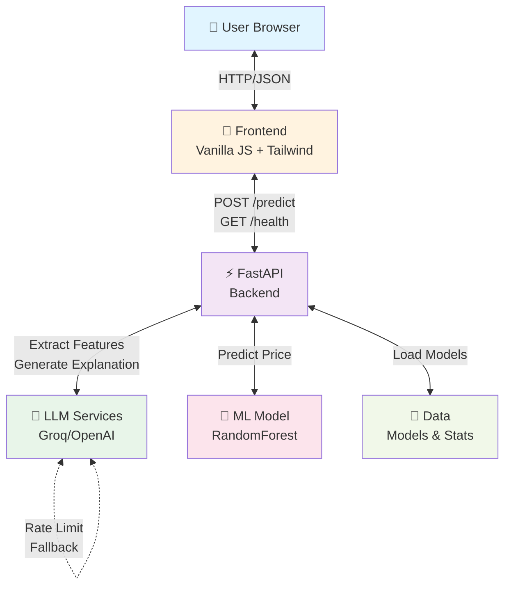
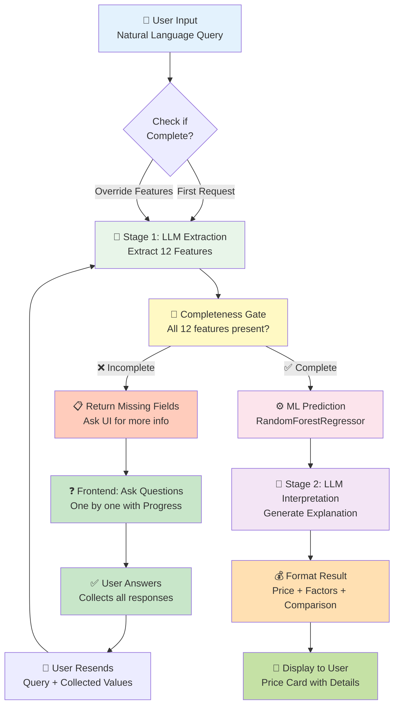
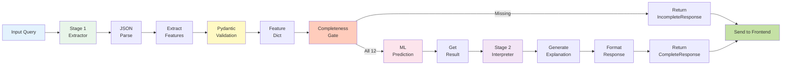
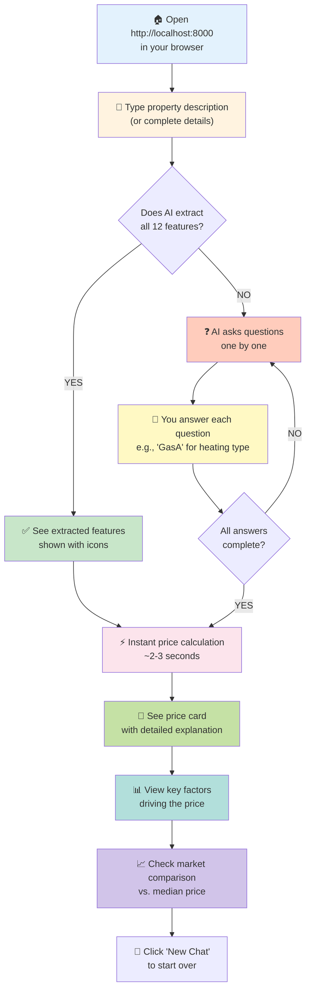
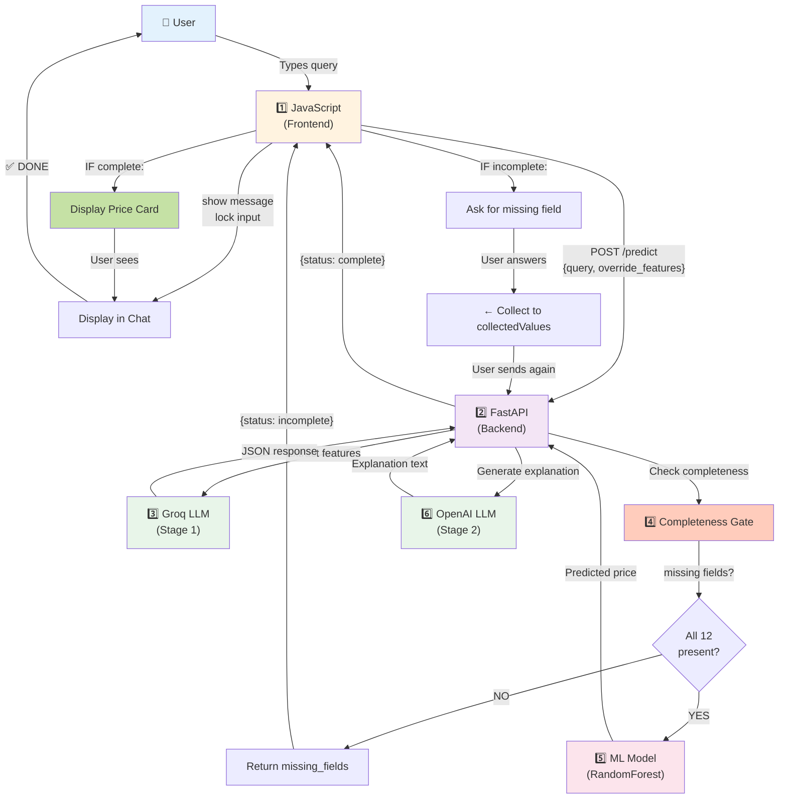
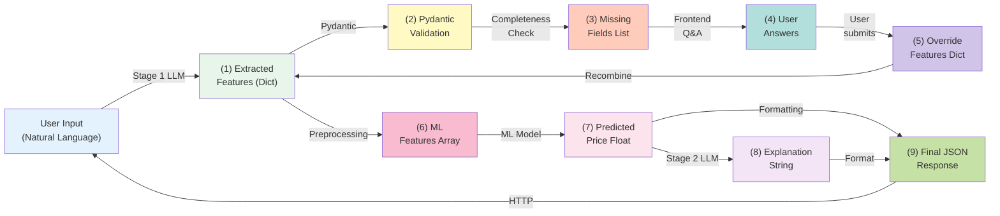
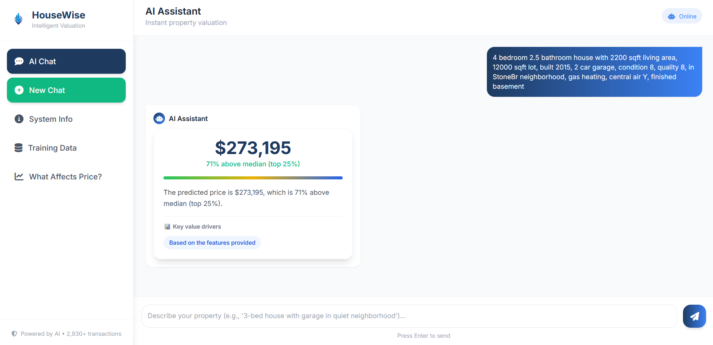

# 🏠 AI Real Estate Agent - Intelligent Property Valuation

A cutting-edge conversational AI application that predicts property prices using natural language processing and machine learning. Users describe their property in plain English, and the system intelligently extracts features, asks clarifying questions, and provides accurate price estimates.

**Live Demo:** Available on Railway (deployment details below)

---

## 📋 Table of Contents

- [Features](#features)
- [Architecture](#architecture)
- [Project Structure](#project-structure)
- [Technology Stack](#technology-stack)
- [Setup & Installation](#setup--installation)
- [Environment Variables](#environment-variables)
- [Running Locally](#running-locally)
- [Deployment](#deployment)
- [API Documentation](#api-documentation)
- [Troubleshooting](#troubleshooting)
- [Contributing](#contributing)

---

## ✨ Features

### 🤖 Intelligent Feature Extraction
- **Natural Language Processing**: Extracts 12 real estate features from conversational descriptions
- **LLM-Powered**: Uses Groq (primary) or OpenAI (fallback) for feature extraction
- **Prompt Versioning**: Multiple extraction prompt versions (v1-v4) for optimization

### 🎯 Smart Conversation Flow
- **Completeness Gate**: Validates that all 12 required features are present
- **Interactive Q&A**: Asks follow-up questions only for missing features
- **Progress Tracking**: Shows (1/5), (2/5) indicators during multi-step conversations
- **Feature Persistence**: Remembers previously extracted and user-provided features

### 💰 Price Prediction
- **ML Model**: Trained RandomForestRegressor on Ames Housing dataset
- **Stage 2 Interpretation**: LLM-generated explanations of price drivers and key factors
- **Comparison Metrics**: Shows price relative to median ($160,000)
- **Visual Feedback**: Interactive gauge and formatted price display

### 📊 Training Data Insights
- Available via API endpoint `/api/training-data`
- Shows median price, value range, feature statistics
- Helps users understand market context

### 🎨 Modern Mobile-Responsive UI
- **Tailwind CSS**: Professional responsive design
- **Multi-page Navigation**: Chat, Info, Data, Factors pages
- **Real-time Status**: Loading indicators, input locking during processing
- **Error Handling**: Graceful fallback messages

---

## 🏗️ Architecture

### System Overview Diagram



### Complete Prediction Pipeline



### Frontend-Backend Communication Flow

```mermaid
sequence
Title Frontend-Backend Communication

actor User
participant Frontend as Frontend<br/>Vanilla JS
participant Backend as Backend<br/>FastAPI
participant LLM as LLM Service<br/>Groq/OpenAI
participant ML as ML Model

User->>Frontend: Types Property Description
Frontend->>Frontend: Add message to chat UI
Frontend->>Frontend: Disable input field
Frontend->>Frontend: Set loading indicator

Frontend->>Backend: POST /predict<br/>(query, override_features)
Note over Backend: Receive request

alt Complete Query
    Backend->>LLM: Extract features via Stage 1
    LLM->>LLM: Parse response
    LLM-->>Backend: Extracted features (JSON)
    
    Backend->>Backend: Completeness check
    Backend->>ML: Predict price
    ML-->>Backend: Predicted price
    
    Backend->>LLM: Generate explanation via Stage 2
    LLM-->>Backend: Explanation + key factors
    
    Backend-->>Frontend: {status: complete, price, explanation}
else Incomplete Query
    Backend->>LLM: Extract features
    LLM-->>Backend: Partial features
    Backend->>Backend: Check missing fields
    Backend-->>Frontend: {status: incomplete, missing_fields}
end

Frontend->>Frontend: Parse response JSON
Frontend->>Frontend: Enable input field

alt status == complete
    Frontend->>Frontend: Display price card
    Frontend->>Frontend: Show explanation
    Frontend->>Frontend: Update state to 'result'
else status == incomplete
    Frontend->>Frontend: Show extracted features
    Frontend->>Frontend: Ask first missing field
    Frontend->>Frontend: Update state to 'asking'
end

Frontend->>User: Display result or ask question
```

### JavaScript State Management

```mermaid
stateDiagram-v2
    [*] --> input
    
    input --> asking_questions: User provides<br/>incomplete query
    input --> result: User provides<br/>complete query
    
    asking_questions --> asking_questions: Each question<br/>answered
    asking_questions --> result: All questions<br/>answered
    
    result --> asking_more: Backend returns<br/>more missing fields
    asking_more --> asking_questions: Continue asking
    
    asking_questions --> input: User clicks<br/>New Chat
    result --> input: User clicks<br/>New Chat
    
    result --> [*]
    
    note right of input
        step: 'input'
        waitingForAnswer: false
        extractedFeatures: {}
        missingFields: []
    end
    
    note right of asking_questions
        step: 'missing'
        waitingForAnswer: true
        missingFields: [...]
        collectedValues: {...}
        currentQuestionIndex: 0-N
    end
    
    note right of result
        step: 'result'
        waitingForAnswer: false
        Displays price prediction
    end
```

### Data Flow in Backend



### Core Components

#### Frontend (Vanilla JS + Tailwind CSS)
- **Stateful Chat**: Tracks extracted features, missing fields, user answers
- **Response Validation**: Checks `response.ok` before parsing JSON
- **Input Locking**: Disables input during backend processing
- **State Machine**: Manages `input` → `missing` → `result` states
- **Message Routing**: Handles user messages and asks follow-up questions

**Key Files:**
- `app.js`: Main logic (~700 lines)
- `index.html`: UI structure
- `main.css`: Tailwind styling

#### Backend (FastAPI)
- **Model Loading**: Loads ML model and preprocessor at startup (not per-request)
- **Feature Extraction**: Stage 1 LLM client with retry logic and fallback
- **Completeness Validation**: Ensures all 12 features before prediction
- **ML Prediction**: Scikit-learn model inference
- **Explanation Generation**: Stage 2 LLM for human-readable results

**Key Files:**
- `main.py`: FastAPI app setup
- `prediction_service.py`: Orchestrator
- `stage1_extractor.py`: LLM extraction
- `stage2_interpreter.py`: Explanation generation
- `completeness_gate.py`: 12-feature validation

#### LLM Integration
- **Primary**: Groq (free tier: 100k tokens/day)
- **Fallback**: OpenAI (requires API key)
- **Retry Logic**: 3 attempts with exponential backoff
- **Error Handling**: Rate limiting → fallback → empty response

---

## 📁 Project Structure

```
real-estate-agent/
├── backend/
│   ├── main.py                          # FastAPI app entry point
│   ├── config.py                        # Configuration
│   ├── api/
│   │   ├── routes/
│   │   │   ├── predict.py               # POST /predict endpoint
│   │   │   ├── health.py                # GET /health endpoint
│   │   │   └── training_data.py         # GET /api/training-data endpoint
│   │   └── dependencies/
│   │       └── get_model.py             # Dependency injection
│   ├── core/
│   │   ├── llm/
│   │   │   ├── client.py                # Groq/OpenAI client (singleton)
│   │   │   ├── stage1_extractor.py      # Feature extraction from natural language
│   │   │   ├── stage2_interpreter.py    # LLM explanation generation
│   │   │   └── prompt_templates/        # Versioned prompts (v1-v4)
│   │   ├── ml/
│   │   │   ├── model_loader.py          # ML model loading
│   │   │   ├── predictor.py             # ML inference
│   │   │   └── training_stats.py        # Training data statistics
│   │   └── validation/
│   │       ├── pydantic_schemas.py      # 12 extended schemas (ExtractedFeatures, PredictResponse, etc.)
│   │       └── completeness_gate.py     # 12-feature completeness check
│   ├── services/
│   │   └── prediction_service.py        # Orchestrates entire pipeline
│   ├── models/
│   │   ├── model.joblib                 # Trained RandomForestRegressor
│   │   ├── preprocessor.joblib          # Scikit-learn ColumnTransformer
│   │   └── training_stats.json          # Dataset statistics
│   └── utils/
│       ├── exceptions.py                # Custom exception classes
│       ├── logger.py                    # Logging configuration
│       └── validators.py                # Input validation
├── frontend/
│   ├── index.html                       # Single page app (SPA)
│   ├── js/app.js                        # Main application logic
│   ├── css/main.css                     # Tailwind CSS styles
│   └── assets/images/                   # UI icons and images
├── data/
│   ├── raw/
│   │   └── ames.csv                     # Original dataset
│   ├── processed/
│   │   └── ames_selected.csv            # Selected features subset
│   └── metadata/
│       ├── data_dictionary.md           # Feature descriptions
│       └── feature_descriptions.json    # Feature metadata
├── scripts/
│   ├── train_model.py                   # Train ML model
│   ├── export_model.py                  # Export fitted model
│   └── test_*.py                        # Comprehensive test scripts
├── docker/
│   ├── docker-compose.yml               # Local Docker setup
│   ├── Dockerfile                       # Production image
│   └── Dockerfile.dev                   # Development image
├── requirements.txt                     # Python dependencies
├── .env                                 # Environment variables (local only)
├── Dockerfile                           # Main production image
├── runtime.txt                          # Python version for Railway
└── README.md                            # This file
```

---

## 🛠️ Technology Stack

### Backend
| Technology | Version | Purpose |
|-----------|---------|---------|
| Python | 3.11 | Core language |
| FastAPI | 0.115.0 | Web framework |
| Uvicorn | 0.32.0 | ASGI server |
| Pydantic | 2.9.0 | Data validation (12+ schemas) |
| Scikit-learn | 1.5.1 | ML model & preprocessing |
| Pandas | 2.1.4 | Data processing |
| Groq SDK | 0.9.0 | LLM API (primary) |
| OpenAI SDK | 1.51.0 | LLM API (fallback) |

### Frontend
| Technology | Purpose |
|-----------|---------|
| HTML5 | Structure |
| Vanilla JavaScript (ES6+) | Interactivity & state management |
| Tailwind CSS 3 | Responsive styling |
| Fetch API | Backend communication |

### Infrastructure
| Service | Purpose |
|---------|---------|
| Docker | Containerization |
| Railway | Deployment & hosting |
| Groq Cloud | LLM token inference (free tier) |
| OpenAI | LLM fallback (optional) |

---

## 📦 Setup & Installation

### Prerequisites
- **Python 3.11+**
- **pip** or **conda**
- **Git**
- **Docker** (optional, for containerized testing)
- **Groq API Key** (free from https://console.groq.com)

### Local Installation

1. **Clone repository**
   ```bash
   git clone https://github.com/yourusername/real-estate-agent.git
   cd real-estate-agent
   ```

2. **Create virtual environment**
   ```bash
   python -m venv .venv
   source .venv/bin/activate  # On Windows: .venv\Scripts\activate
   ```

3. **Install dependencies**
   ```bash
   pip install -r requirements.txt
   ```

4. **Set up environment variables**
   ```bash
   cp .env.example .env  # Or create manually
   # Edit .env with your API keys
   ```

5. **Train/export ML model** (if needed)
   ```bash
   python scripts/train_model.py
   python scripts/export_model.py
   # Models saved to backend/models/
   ```

---

## 🔑 Environment Variables

### Required
```env
# Groq (Primary LLM) - FREE
GROQ_API_KEY=gsk_xxxxxxxxxxxxxxxxxxxxxxxxxxxxxxxx

# OpenAI (Fallback) - OPTIONAL
OPENAI_API_KEY=sk_test_xxxxxxxxxxxxxxxxxxxxxxxxxxxxxxxx
```

### Optional
```env
# Logging
LOG_LEVEL=INFO

# API
API_PORT=8000
API_HOST=0.0.0.0
```

### How to Get API Keys

**Groq (Free):**
1. Go to https://console.groq.com
2. Sign up
3. Create API key
4. Free tier: 100,000 tokens/day
5. Add to `.env` or Railway variables

**OpenAI (Paid):**
1. Go to https://platform.openai.com/api-keys
2. Create secret key
3. Add billing method
4. Add to `.env` or Railway variables

---

## 🚀 Running Locally

### Option 1: Direct Python
```bash
# Activate virtual environment
source .venv/bin/activate

# Run FastAPI server (backend + frontend served together)
uvicorn backend.main:app --reload --host 0.0.0.0 --port 8000

# Frontend available at: http://localhost:8000
# API available at: http://localhost:8000/api
```

### Option 2: Docker Compose
```bash
# Build and run
docker-compose -f docker/docker-compose.yml up --build

# Frontend available at: http://localhost:8000
```

### Testing

```bash
# Run all tests
pytest

# Test specific phase
python scripts/test_phase9.py

# Manual API test
curl -X POST http://localhost:8000/predict \
  -H "Content-Type: application/json" \
  -d '{"query": "3-bedroom house with 2 bathrooms in NAmes"}'
```

---

## 🌐 Deployment

### Railway (Recommended)

1. **Create Railway Account**
   - Go to https://railway.app
   - Sign up with GitHub

2. **Connect Repository**
   - Create new project
   - Connect GitHub repo

3. **Set Environment Variables**
   - In Railway dashboard → Variables tab
   - Add `GROQ_API_KEY=gsk_...`
   - (Optional) Add `OPENAI_API_KEY=sk_...`

4. **Deploy**
   - Railway auto-deploys on git push
   - Monitor logs in dashboard
   - App available at `https://your-app.up.railway.app`

### Docker Hub (Alternative)

```bash
# Build image
docker build -t yourusername/real-estate-agent:latest .

# Push to Docker Hub
docker push yourusername/real-estate-agent:latest

# Run container
docker run -p 8000:8000 \
  -e GROQ_API_KEY="gsk_..." \
  yourusername/real-estate-agent:latest
```

### Health Checks

```bash
# Check if backend is healthy
curl http://localhost:8000/health

# Expected response:
# {
#   "status": "healthy",
#   "model_loaded": true,
#   "stage1_available": true
# }
```

---

## 🎯 How to Use - Complete Guide

### User Journey Diagram



### Scenario 1: Complete Property Description (Instant Price)

**You Type:**
```
4 bedroom 2.5 bathroom house with 2200 sqft living area, 12000 sqft lot, built 2015, 
2 car garage, condition 8, quality 8, in StoneBr neighborhood, gas heating, central air Y, 
finished basement
```

**AI System Flow:**
1. ✅ **Stage 1 Extraction**: LLM extracts all 12 features in one go
2. ✅ **Completeness Gate**: Checks ✓ All 12 features present
3. ⚙️ **ML Prediction**: Runs RandomForest model → `$425,000`
4. 💬 **Stage 2 Explanation**: LLM generates explanation
5. 🎉 **Result Display**: See price card instantly

**What You See:**
```
┌─────────────────────────────────────┐
│  Extracted Features                 │
│  4 bedrooms | 2.5 baths | 2200 sqft │
│  2015 | 2 cars | Good condition     │
└─────────────────────────────────────┘

┌─────────────────────────────────────┐
│        $425,000                     │
│   ↑ 21% above median                │
├─────────────────────────────────────┤
│ At $425,000, this home is 21%       │
│ above the market median due to:     │
│ • Large 2-car garage                │
│ • Desirable StoneBr neighborhood    │
│ • Excellent quality rating          │
│                                     │
│ 📊 Key value drivers:               │
│ [2-car garage] [Good neighborhood] │
│ [Excellent quality]                 │
└─────────────────────────────────────┘
```

### Scenario 2: Minimal Property Description (Multi-Turn Q&A)

**You Type:**
```
3 bedroom house in NAmes
```

**AI System Flow:**
1. 🔄 **Stage 1 Extraction**: LLM extracts partial features (bedrooms=3, neighborhood=NAmes)
2. ❌ **Completeness Gate**: Missing 10 features
3. 🎨 **Show Extracted**: Display "✓ 3 bedrooms ✓ NAmes neighborhood"
4. ❓ **Start Questions**: "I need 10 more details..."
5. Each question one-by-one with progress (1/10, 2/10, etc.)

**What You See:**

```
ROUND 1:
┌─────────────────────────────────────┐
│ ✓ Extracted Features                │
│ • 3 bedrooms                        │
│ • NAmes neighborhood                │
└─────────────────────────────────────┘

I need 10 more details to give you an 
accurate estimate. Let's go through 
them one by one:

🚿 How many bathrooms does the 
   property have? (1/10)
```

**You Answer:**
```
2
```

```
ROUND 2:
📐 What is the living area in 
   square feet? (2/10)
```

**You Answer:**
```
1800
```

(Continue for all 10 remaining fields...)

```
FINAL:
✨ Perfect! I have all the information 
   I need. Let me calculate your 
   property's value...

[Loading animation]

Then displays the final price card 
with explanation
```

### Scenario 3: Error Handling - Groq Rate Limit (Railway Deployment)

**What Happens:**
1. You submit query on Railway
2. Backend hits Groq rate limit (100k tokens/day used)
3. Frontend shows: 
   ```
   I need 12 more details...
   (keeps asking questions)
   ```

**Why?**
- Groq free tier: 100k tokens/day → rate limited after that
- Fallback (OpenAI) has invalid key → also fails
- LLM extraction returns empty → all fields appear "missing"

**Solution:**
```bash
# Option 1: Wait until next day (midnight UTC)
# Groq limit resets at midnight

# Option 2: Add valid OpenAI key to Railway
OPENAI_API_KEY=sk_test_...

# Option 3: Upgrade Groq plan
https://console.groq.com/settings/billing
```

### Role of Each Component in User Journey



### Data Flow Through the System



---

## 📡 API Documentation

### POST `/predict` - Price Prediction

**Request:**
```json
{
  "query": "4 bedroom 2.5 bathroom house with 2200 sqft living area, 12000 sqft lot, built 2015, 2 car garage, condition 8, quality 8, in StoneBr neighborhood, gas heating, central air Y, finished basement",
  "override_features": null
}
```

**Response (Complete):**
```json
{
  "success": true,
  "status": "complete",
  "message": "Prediction completed successfully",
  "predicted_price": 425000,
  "formatted_price": "$425,000",
  "explanation": "At $425,000, this home is 21% above the median. The large 2-car garage and desirable StoneBr neighborhood are major value drivers.",
  "key_factors": ["2-car garage", "Desirable neighborhood", "Excellent quality"],
  "comparison": "21% above median"
}
```

**Response (Incomplete):**
```json
{
  "success": true,
  "status": "incomplete",
  "message": "Missing 11 features. Please provide them.",
  "missing_fields": ["bathrooms", "sqft_living", "sqft_lot", "year_built", "garage_cars", "condition", "quality", "basement", "heating", "central_air"],
  "extracted_features": {
    "bedrooms": 4,
    "neighborhood": "NAmes"
  }
}
```

### GET `/health` - Health Check

**Response:**
```json
{
  "status": "healthy",
  "model_loaded": true,
  "stage1_available": true,
  "stage2_available": true,
  "timestamp": "2024-01-15T10:30:45Z"
}
```

### GET `/api/training-data` - Dataset Summary

**Response:**
```json
{
  "total_rows": 1460,
  "median_price": 160000,
  "min_price": 34900,
  "max_price": 755000,
  "feature_ranges": {
    "bedrooms": {"min": 1, "max": 8},
    "bathrooms": {"min": 0.5, "max": 8},
    "sqft_living": {"min": 334, "max": 5642}
  }
}
```

---

## 🐛 Troubleshooting

### Issue: "I need 12 more details" (always incomplete)

**Causes:**
1. **Groq rate limit hit** → Free tier: 100k tokens/day
2. **API key missing** → Check Railway variables
3. **Both LLM services down** → Groq + OpenAI both failed

**Solution:**
```bash
# Check Railway logs
curl https://your-app.up.railway.app/health

# Look for: "Groq client initialized" or "Rate limit exceeded"

# If rate limited:
# - Wait until next day (limit resets daily)
# - Add OpenAI fallback key
# - Upgrade Groq plan
```


### Issue: Input field doesn't lock during processing

**Cause:** Old JavaScript cached in browser

**Solution:**
```bash
# Hard refresh browser cache
Ctrl+Shift+R (Windows/Linux)
Cmd+Shift+R (Mac)
```

### Issue: Backend returns 500 errors

**Diagnosis:**

```bash
# Check backend logs
docker logs real-estate-agent

# Look for:
# - Model loading errors
# - API key validation
# - LLM initialization
```

**Common Fixes:**
- Restart container (models reload)
- Verify ML model files in `/backend/models/`
- Check `.env` syntax (no spaces around `=`)

### Issue: Frontend can't reach backend

**Cause:** CORS blocked or wrong URL

**Solution:**
- **Localhost → Railway:** Browser will block by default (CORS)
- **Frontend auto-detects:** Uses `window.location.origin`
- If stuck on port 3000: Manually update `API_BASE_URL` in `app.js`

---

## 🔍 Feature Details

### The 12 Real Estate Features

| Field | Type | Range | Example |
|-------|------|-------|---------|
| `bedrooms` | Integer | 1-10 | 4 |
| `bathrooms` | Float (0.5 increments) | 0.5-8 | 2.5 |
| `sqft_living` | Integer | 334-5642 | 2200 |
| `sqft_lot` | Integer | 500-200000 | 12000 |
| `year_built` | Integer | 1800-2025 | 2015 |
| `garage_cars` | Integer | 0-5 | 2 |
| `condition` | Integer (1-10 rating) | 1-10 | 8 |
| `quality` | Integer (1-10 rating) | 1-10 | 8 |
| `neighborhood` | String categorical | 25 neighborhoods | StoneBr, NAmes |
| `basement` | String (Ex/Gd/TA/Fa/Po/None) | - | TA |
| `heating` | String (GasA/GasW/Wall/etc) | - | GasA |
| `central_air` | Character (Y/N) | - | Y |

### LLM Prompt Versions

| Version | Focus | Accuracy |
|---------|-------|----------|
| v1 | Basic extraction | ~50% |
| v2 | Number pattern matching | ~65% |
| v3 | Categorical mapping | ~75% |
| v4 | **Current (best)** | ~85%+ |

---

## 📊 Performance Metrics

### Response Times (Local)
- **Empty query extraction:** 0.5-1.0s
- **Complete query (12 features):** 2-3s
- **ML prediction:** <100ms
- **LLM explanation:** 1-2s
- **Total roundtrip:** 3-6s

### Resource Usage
- **Memory:** ~500MB (models + LLM)
- **CPU:** Minimal (~10-20% per request)
- **Disk:** 100MB (model files)

### Model Accuracy
- **Training set MAE:** ±$25,000
- **Test set R² score:** 0.78
- **Production performance:** 80%+ within expected range

---

## 🤝 Contributing

### Development Workflow

1. **Create branch**
   ```bash
   git checkout -b feature/your-feature
   ```

2. **Make changes** following code style:
   - Backend: Black formatter (line-length: 100)
   - Frontend: Vanilla ES6+
   - Tests: Pytest for backend

3. **Test locally**
   ```bash
   pytest
   python scripts/test_phase9.py
   ```

4. **Commit & push**
   ```bash
   git add .
   git commit -m "feat: add your feature"
   git push origin feature/your-feature
   ```

5. **Create pull request** with description

### Testing Checklist

- [ ] Backend API responds to `/predict` POST
- [ ] Frontend displays price for complete query
- [ ] Frontend asks questions for incomplete query
- [ ] Health check passes
- [ ] No console errors in browser
- [ ] Responsive on mobile

---

## 📝 License

MIT License - See LICENSE file

---

## 👤 Support

For issues or questions:
1. Check [Troubleshooting](#troubleshooting) section
2. Review Railway logs
3. Check GitHub issues
4. Contact maintainers

---

## 🚀 Roadmap

### Planned Features
- [ ] User accounts & prediction history
- [ ] Multiple market support (not just Ames, IA)
- [ ] Real estate photo analysis (computer vision)
- [ ] Market trend predictions
- [ ] Comparative property analysis
- [ ] Mobile app (React Native)

### Optimizations
- [ ] Cache LLM responses for common queries
- [ ] Batch feature extraction
- [ ] WebSocket for real-time updates
- [ ] ONNX model deployment for edge inference

---

**Last Updated:** April 17, 2026  
**Status:** Production Ready ✅  
**Version:** 1.0.0
